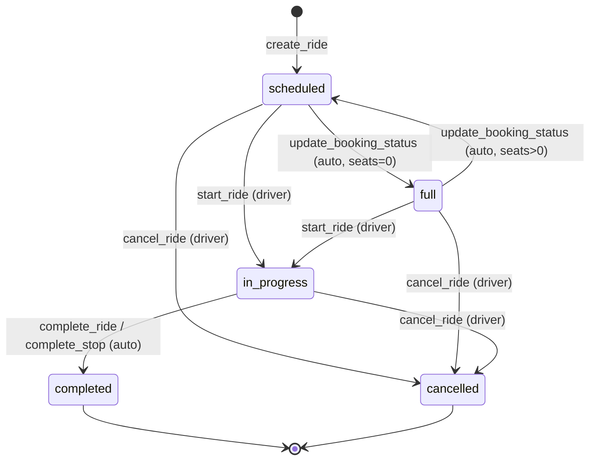
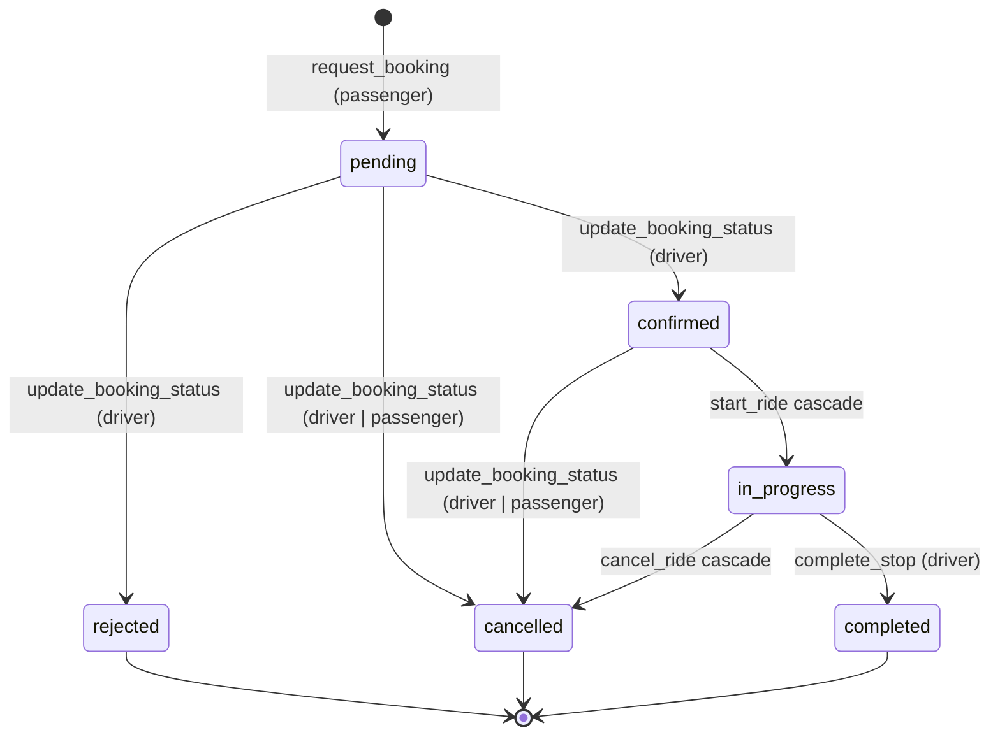

# Máquina de estados: Rides y Bookings

Este documento describe estados, transiciones y side-effects alineados con el
esquema Postgres actual. Cualquier cambio en RPCs, RLS o UI debe mantenerse
consistente con esta tabla.

## 1. Ride (`public.rides.status`)

Valores permitidos por el CHECK constraint:

```
scheduled | full | in_progress | completed | cancelled
```

### Transiciones



| Evento               | Actor     | Pre-condición                     | Side-effects                                                              |
| -------------------- | --------- | --------------------------------- | ------------------------------------------------------------------------- |
| `create_ride`        | conductor | perfil aprobado y vehículo activo | Inserta `ride` con `status='scheduled'` y stops.                          |
| `start_ride`         | conductor | `scheduled` o `full`              | Bookings `pending` → `cancelled`; ride → `in_progress`.                   |
| `complete_stop`      | conductor | `in_progress`                     | Booking → `completed`; si todos completed → ride `completed` automático.  |
| `complete_ride`      | conductor | `in_progress`                     | Force-completes remaining bookings; ride → `completed`; cierra chat.      |
| `cancel_ride`        | conductor | `scheduled`, `full` o `in_progress`| Suma asientos de `confirmed`; bookings activas → `cancelled`; ride → `cancelled`. |

## 2. Booking (`public.bookings.status`)

Valores permitidos por el CHECK constraint:

```
pending | confirmed | rejected | cancelled | in_progress | completed
```

### Transiciones



| Transición              | Actor               | Side-effects                                                         |
| ----------------------- | ------------------- | -------------------------------------------------------------------- |
| `pending → confirmed`   | **conductor**       | Decrementa `rides.available_seats`. Auto `full` si seats=0.          |
| `pending → rejected`    | **conductor**       | Sin movimiento de asientos (pending no consumía cupo).               |
| `pending → cancelled`   | conductor o pasajero| Sin movimiento de asientos.                                          |
| `confirmed → cancelled` | conductor o pasajero| Restaura `rides.available_seats`. Auto `scheduled` si era `full`.    |
| `confirmed → in_progress`| cascada `start_ride`| Bookings confirmadas pasan a in_progress con el viaje.               |
| `in_progress → completed`| `complete_stop`    | Si todas completed → ride `completed` automáticamente.               |
| Cascada `cancel_ride`   | conductor           | Restaura cupos de confirmados y cancela activas.                     |
| Cascada `start_ride`    | conductor           | Todas las `pending` → `cancelled`.                                   |

## 3. Reglas de autorización (resumen)

- `confirmed` / `rejected`: solo el conductor del ride.
- `cancelled`: conductor o pasajero dueño de la booking.
- Inicio/finalización/cancelación del viaje: solo conductor.

## 4. Eventos del sistema

| Evento (cliente)              | Disparado por                 | Mecanismo típico                                    |
| ----------------------------- | ----------------------------- | --------------------------------------------------- |
| Solicitud creada              | `request_booking`            | `postgres_changes` en `bookings`                    |
| Solicitud actualizada         | `update_booking_status`      | `postgres_changes` en `bookings`                    |
| Viaje iniciado/fin/cancel     | RPCs de ciclo de vida        | `postgres_changes` en `rides`                       |
| Posición del conductor        | `useDriverLocationBroadcast` | `broadcast` en `ride-track:<rideId>`               |
| Mensaje de chat               | INSERT `chat_messages`       | `postgres_changes` en `chat_messages`               |

## 5. Reviews (`public.ride_reviews`)

| Evento            | Actor              | Pre-condición                    | Side-effects                                    |
| ----------------- | ------------------ | -------------------------------- | ----------------------------------------------- |
| `submit_review`   | conductor/pasajero | ride `completed`, participación  | Upsert en `ride_reviews`; trigger actualiza `users.rating` y `driver_profiles.rating`. |

## 6. Indicadores visuales (`StatusBadge`)

| Estado      | Tono     | Etiqueta ES    |
| ----------- | -------- | -------------- |
| pending     | warning  | Pendiente      |
| confirmed   | success  | Confirmada     |
| rejected    | error    | Rechazada      |
| cancelled   | neutral  | Cancelada      |
| in_progress | info     | En progreso    |
| completed   | success  | Completado     |
| scheduled   | info     | Programado     |
| full        | warning  | Completo       |
| open        | info     | Abierto        |
